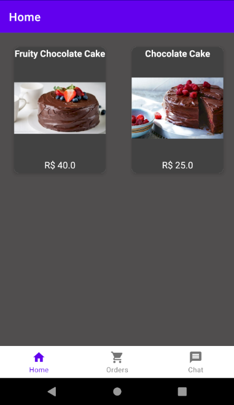
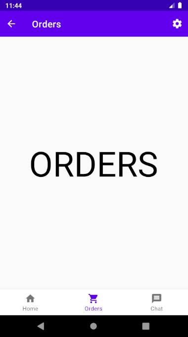
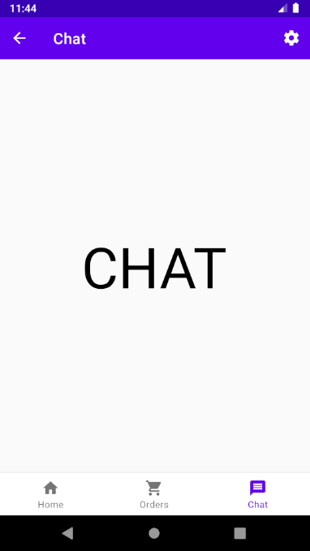
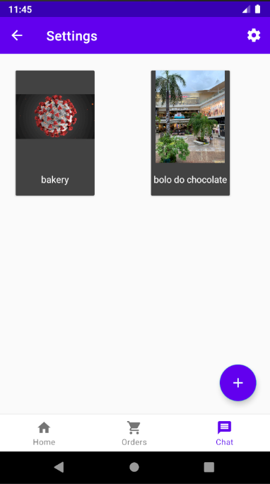
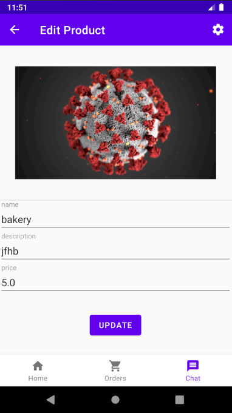
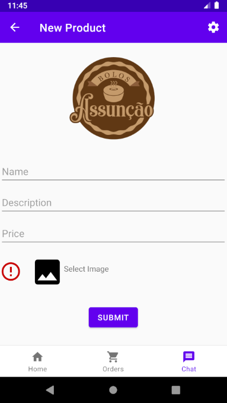

# BolosAssuncao

GOAL : 

Build a product with a login system for customers and the "privilaged/business side users" to allow p2p communication and product ordering.

In the meantime practicing Kotlin and other industry standard techiniques and libaries.

Requirements :

Current UI : In progress

 

 

