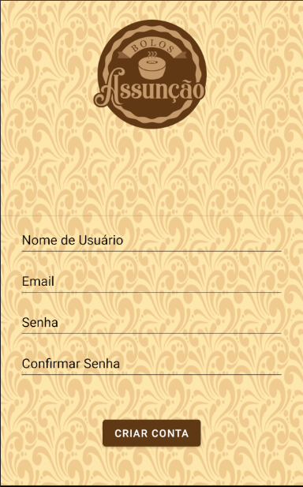
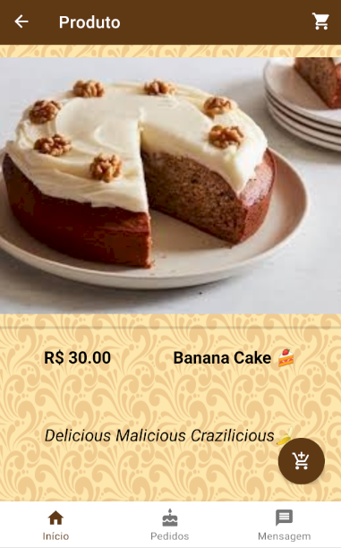
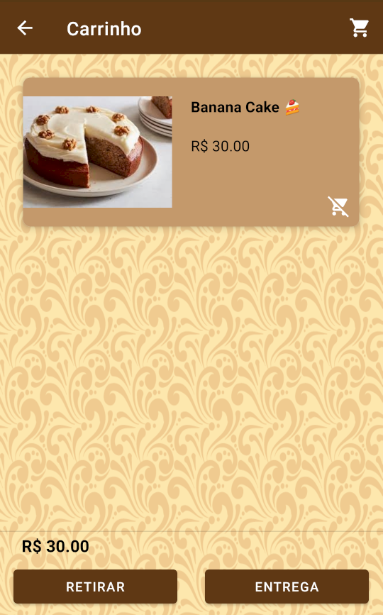
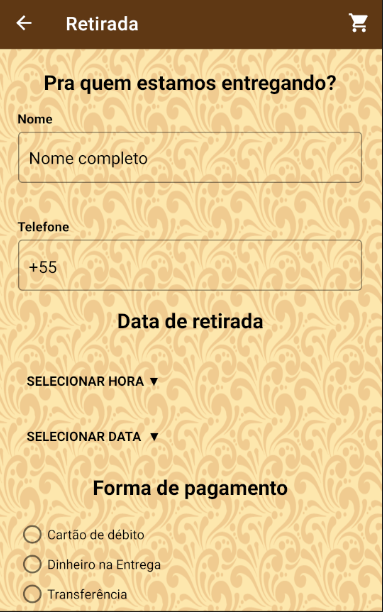
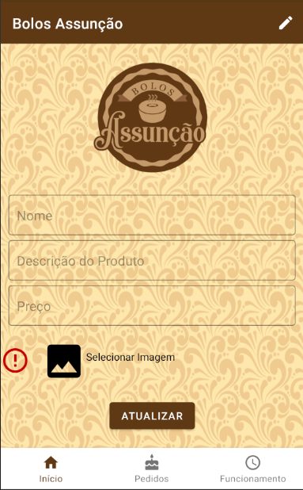

# BolosAssuncao

## Tech Stack & Open-Library Sources : 
+ Minimum SDK level 21
+ 100% Kotlin based + Coroutines
+ JetPack
   + LiveData - notify domain layer data to views.
   + Lifecycle - dispose observing data when lifecycle state changes.
   + ViewModel - UI related data holder, lifecycle aware.
   + Room Persistence - construct database.
   + Jetpack Navigation
+ Firebase Notifications
+ Data Binding
+ Architecture
   + MVVM Architecture (View - DataBinding - ViewModel - Model)
   + Repository pattern

+ Material Design & Animations
   + LottieFlies
  
+ Retrofit2 & Gson - constructing the REST API

## GOAL : 

Build a product with a login system for customers and the "privilaged/business side users" to allow p2p communication and product ordering.

In the meantime practicing Kotlin and other industry standard techiniques and libaries.

###### (Current scope only aim at one business)
###### Requirements :

- All users must be able to login
- Privilaged users must have an option to add new products
- Privilaged users must have an option to delete/edit products
- Privilaged users should be able to manage orders
- Privilaged users must be able to use the chat to speak to customers

- Ordinary users must be able to view all products
- Ordinary users must be able to create an order
- Ordinary users must be able to contact the privilaged users

## Current User UI : In progress

 
 
 

## Current Admin UI : In progress

 

