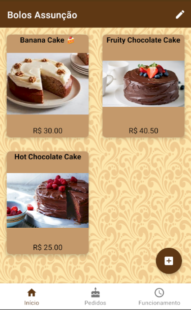

# BolosAssuncao

## GOAL : 

Build a product with a login system for customers and the "privilaged/business side users" to allow p2p communication and product ordering.

In the meantime practicing Kotlin and other industry standard techiniques and libaries.

###### (Current scope only aim at one business)
###### Requirements :

- All users must be able to login
- Privilaged users must have an option to add new products
- Privilaged users must have an option to delete/edit products
- Privilaged users should be able to manage orders
- Privilaged users must be able to use the chat to speak to customers

- Ordinary users must be able to view all products
- Ordinary users must be able to create an order
- Ordinary users must be able to contact the privilaged users

## Current User UI : In progress

 

## Current Admin UI : In progress

 

